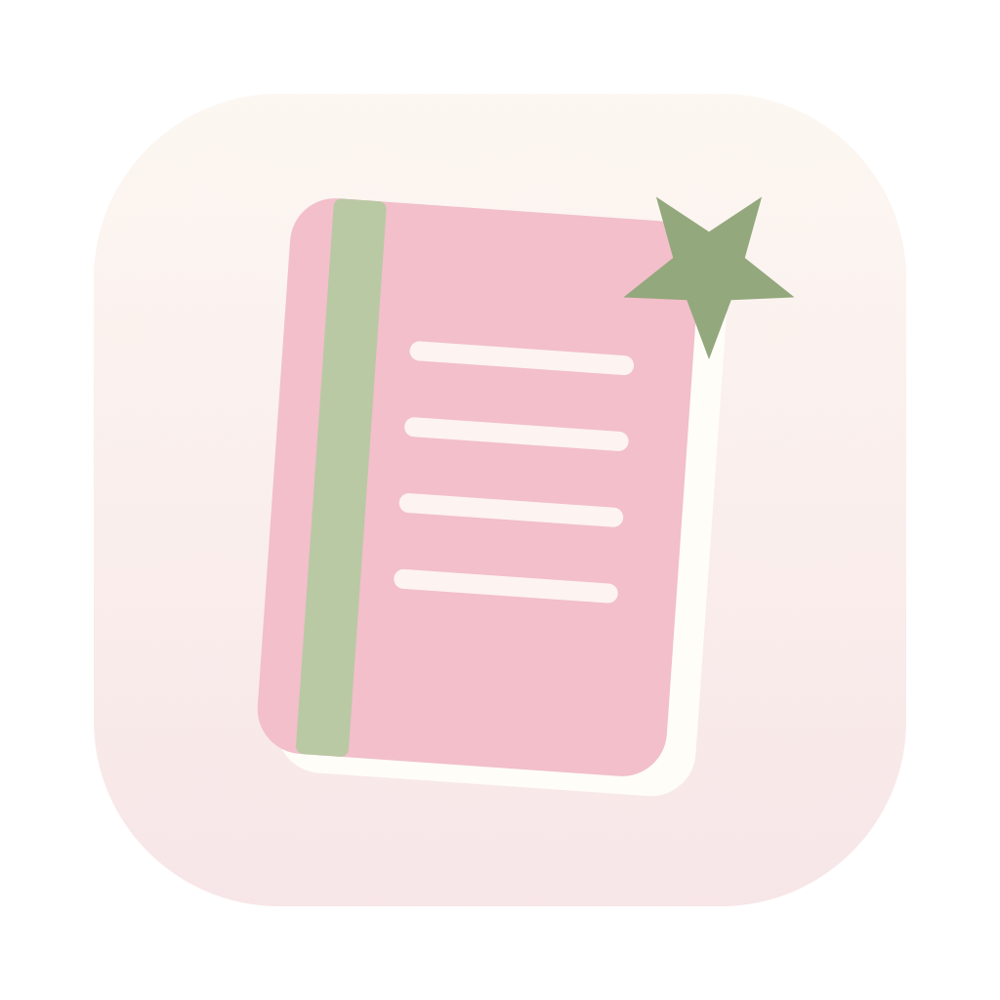

# Nook

Caderninho digital para macOS. Cada **nook** é um ambiente separado com suas
próprias páginas, e cada página é uma folha livre onde você posiciona texto,
listas e figurinhas onde quiser — não é um documento que empurra tudo pra
baixo, é uma superfície.

## O que dá pra fazer

**Escrever.** Caixas de texto com formatação de verdade: negrito, itálico,
sublinhado, sete fontes, sete tamanhos, dez cores e cinco marca-textos pastéis.

**Escolher a folha.** Lisa, pautada ou quadriculada, por página. Em folha
pautada o texto encaixa nas linhas; os widgets ficam livres.

**Soltar templates.** Clique pra colocar em cascata ou arraste pra escolher o
lugar exato:

| | |
|---|---|
| **Semana** | sete dias datados, cada um com nota e listinha própria |
| **To-do list** | título editável, riscar, adicionar e remover itens |
| **Water track** | quantidade de copos e volume configuráveis |
| **Imagem / GIF** | busca no GIPHY, ou `Cmd+V`, ou arrastar do navegador |

**Desenhar.** Lápis à mão livre com oito cores, quatro espessuras e borracha.

**Modo claro e escuro**, seguindo o sistema ou fixo.

## Rodar

Precisa de macOS 14+ e Xcode 16+.

```bash
./Scripts/run.sh          # compila, empacota e abre
./Scripts/run.sh release  # build otimizada
swift test                # 9 testes
```

`Scripts/bundle.sh` monta o `.app` — SwiftPM sozinho só produz um binário solto,
sem `Info.plist` nem ícone.

Pra mexer no ícone: edita `variantA` em `Scripts/make_icon.swift` (é desenho em
CoreGraphics, não imagem) e roda `./Scripts/make_icon.sh`.
